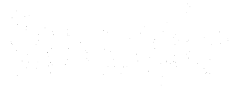

# lintsampler


**Efficient random sampling via linear interpolation.**

[](https://github.com/aneeshnaik/lintsampler/actions/workflows/test.yaml)
[](https://coveralls.io/github/aneeshnaik/lintsampler?branch=main)
[](https://lintsampler.readthedocs.io/en/latest/?badge=latest)
[](https://github.com/aneeshnaik/lintsampler/blob/main/LICENSE)
[](https://joss.theoj.org/papers/133f9681a79ab47b916ecee9e183be9e)

When you have a density function, but you would like to create a set of sample points from that density function, you can use _linear interpolate sampling_. Using the evaluation of the density at the two endpoints of 1D interval, or the four corners of a 2D rectangle, or generally the $2^k$ vertices of a $k$-dimensional hyperbox (or a series of such hyperboxes, e.g., the cells of a $k$-dimensional grid), linear interpolant sampling is a technique to draw random samples within the hyperbox. `lintsampler` provides a Python implementation of this.

See the [documentation](https://lintsampler.readthedocs.io/) for further details.

This package was also reviewed for the Journal of Open Source Software (JOSS). See the paper [here](https://joss.theoj.org/papers/133f9681a79ab47b916ecee9e183be9e) and the review thread [here](https://github.com/openjournals/joss-reviews/issues/6906).

## Installation

Three ways of installing `lintsampler`:

- `pip`:
```
pip install lintsampler
```

- `conda`:
```
conda install -c conda-forge lintsampler
```

- Simply cloning this repository.

## Quickstart Example

If you have a density function, such as this multi-modal 1d pdf with the bulk of the density between -7 and 7,

```python
import numpy as np
from scipy.stats import norm

def gmm_pdf(x):
    mu = np.array([-3.0, 0.5, 2.5])
    sig = np.array([1.0, 0.25, 0.75])
    w = np.array([0.4, 0.25, 0.35])
    return np.sum([w[i] * norm.pdf(x, mu[i], sig[i]) for i in range(3)], axis=0)
```

`lintsampler` can efficiently draw samples from it on some defined interval (here a 100-point grid between -7 and 7):

```python
from lintsampler import LintSampler

grid = np.linspace(-7,7,100)
samples = LintSampler(grid,pdf=gmm_pdf).sample(N=10000)
```

Making a histogram of the resulting samples and comparing to the input density function shows good agreement -- and we can do even better by increasing the resolution.


See [this page of the documentation](https://lintsampler.readthedocs.io/en/latest/examples/1_gmm.html) for a more detailed explanation of this example.

## Documentation

Complete documentation, including more example notebooks, is available at [lintsampler.readthedocs.io/](https://lintsampler.readthedocs.io/).

## Contributing

The `lintsampler` maintainers welcome contributions to software, examples, and documentation. The maintainers are actively monitoring pull requests and would be happy to collaborate on contributions or ideas. If you have any requests for additional information or find any bugs, please open an issue directly.

## Attribution

If using `lintsampler` for a research publication, please cite our [paper](https://joss.theoj.org/papers/133f9681a79ab47b916ecee9e183be9e). 

## License

`lintsampler` is available under the MIT license. See the LICENSE file for specifics.
