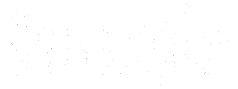
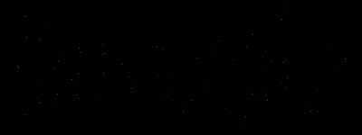
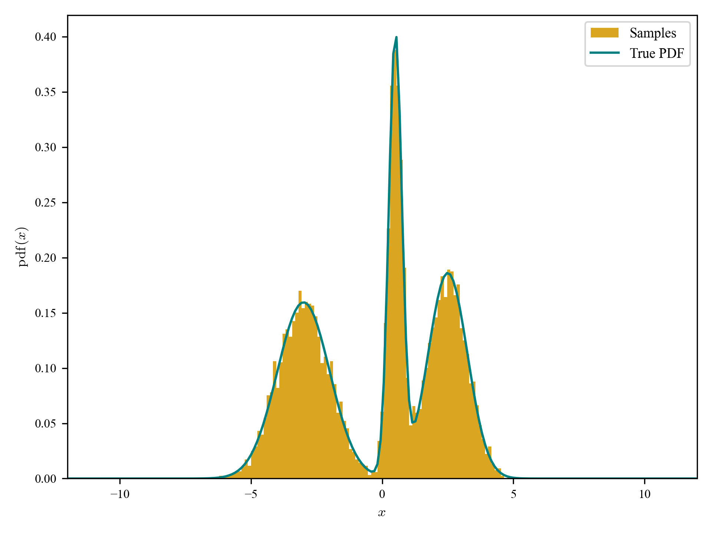

# lintsampler




When you have a density function, but you would like to create a set of sample points from that density function, you can use _linear interpolant sampling_. Using the evaluation of the density at the two endpoints of 1D interval, or the four corners of a 2D rectangle, or generally the $2^k$ vertices of a $k$-dimensional hyperbox (or a series of such hyperboxes, e.g., the cells of a $k$-dimensional grid), linear interpolant sampling is a technique to draw random samples within the hyperbox. `lintsampler` provides a Python implementation of linear interpolation sampling, using only `numpy`. The source code is a public repository on [GitHub](https://github.com/aneeshnaik/lintsampler).

`lintsampler` was also reviewed for the Journal of Open Source Software (JOSS). See the paper [here](https://joss.theoj.org/papers/133f9681a79ab47b916ecee9e183be9e) and the review thread [here](https://github.com/openjournals/joss-reviews/issues/6906).

These pages describe how linear interpolation sampling works and how to use `lintsampler`. As a quick example, if you have a density function, such as this multi-modal 1d pdf with the bulk of the density between -7 and 7,

```python
import numpy as np
from scipy.stats import norm

def gmm_pdf(x):
    mu = np.array([-3.0, 0.5, 2.5])
    sig = np.array([1.0, 0.25, 0.75])
    w = np.array([0.4, 0.25, 0.35])
    return np.sum([w[i] * norm.pdf(x, mu[i], sig[i]) for i in range(3)], axis=0)
```

`lintsampler` can efficiently draw samples from it on some defined interval (here a 100-point grid between -7 and 7):

```python
from lintsampler import LintSampler

grid = np.linspace(-7,7,100)
samples = LintSampler(grid,pdf=gmm_pdf).sample(N=10000)
```

Making a histogram of the resulting samples and comparing to the input density function shows good agreement -- and we can do even better by increasing the resolution of the grid or the number of samples.



```{toctree}
:caption: User Guide
:hidden: true
:maxdepth: 1

installation
usage
whentouse
lintsampler
densitystructure
densitygrid
densitytree
attribution
license
```

```{toctree}
:caption: Examples
:hidden: true
:maxdepth: 1

example_notebooks/1_gmm
example_notebooks/2_doughnuts
example_notebooks/3_dark_matter
example_notebooks/4_qmc
example_notebooks/bonus_logo
```

```{toctree}
:caption: Theory
:hidden: true
:maxdepth: 1

theory/preamble.md
theory/inverse_sampling
theory/linear_interpolant.md
theory/worked_example.md
theory/error_scaling.md
```
